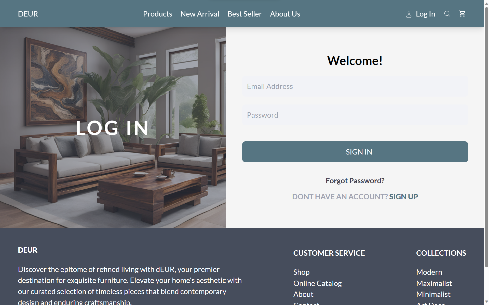
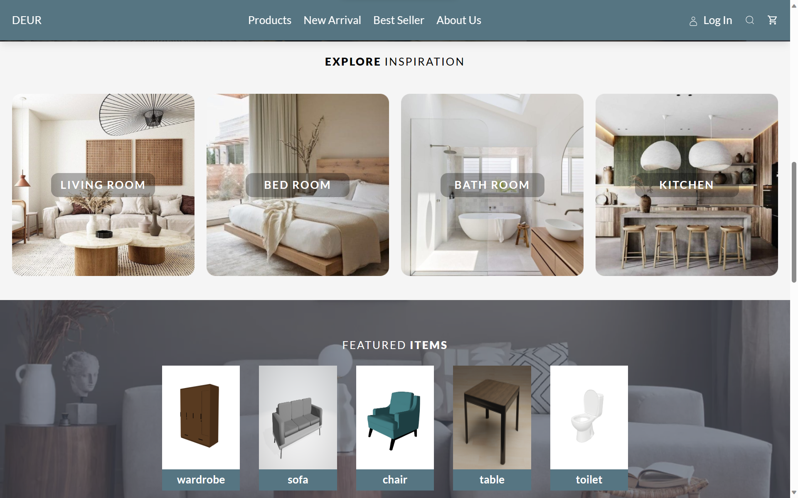
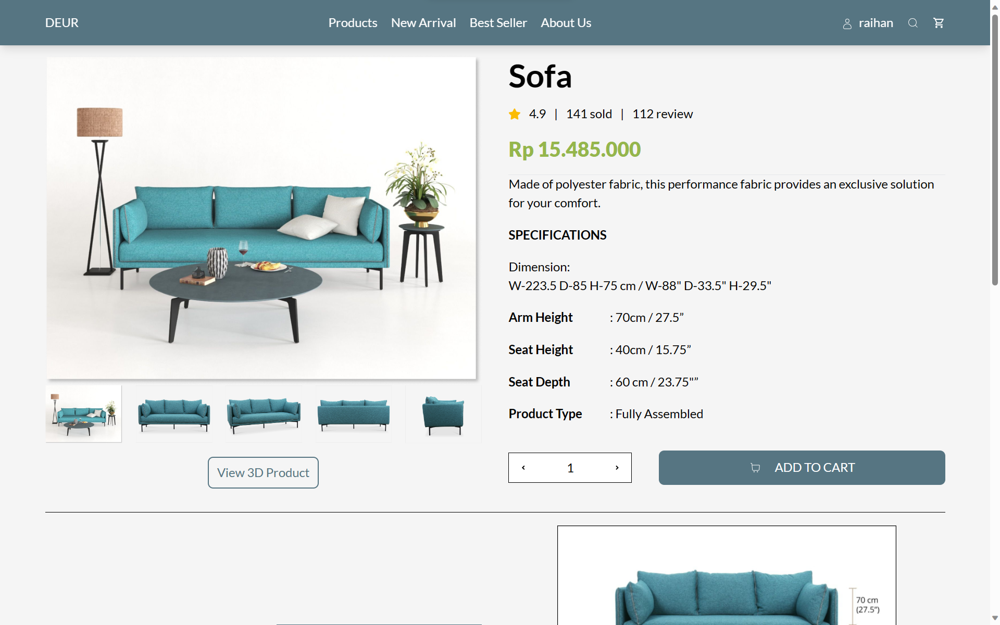
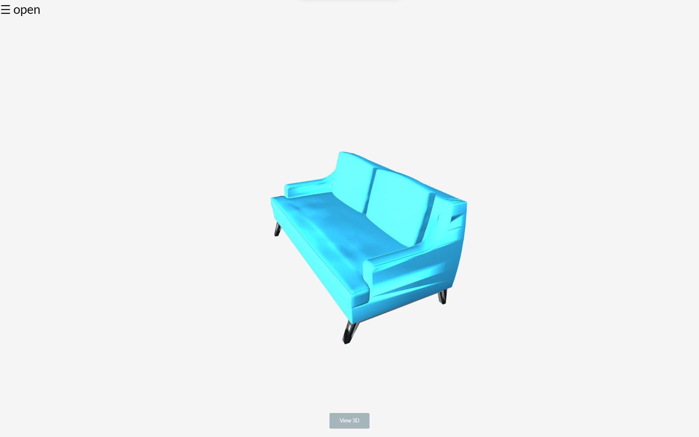
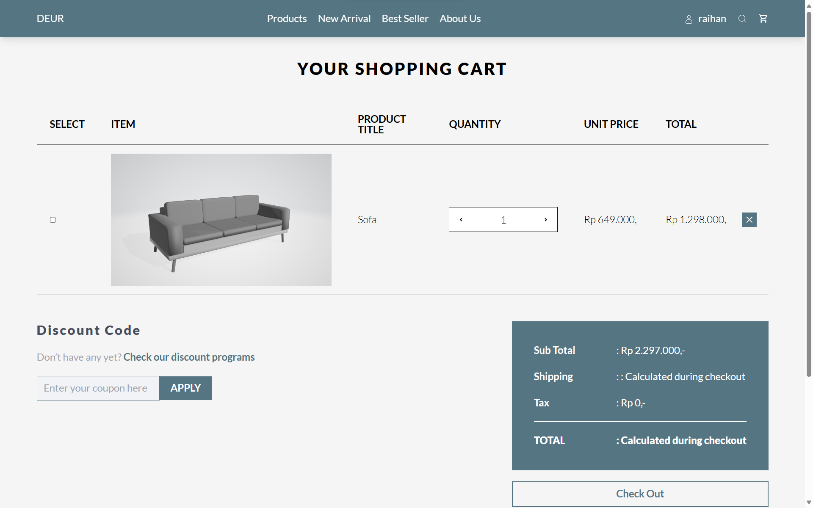

# DEUR

## What is DEUR?
DEUR is A.I based app to help people with setting up room layout by room design and money budgeting. We also help users buy furniture by providing features to buy products directly from official sellers.

## Features
- [x] Authentication
- [x] Checkout System
- [x] Searching for products
- [x] AR 3D product

## Scrrenshot
**Login View**


**Dashboard View**


**Porduct Detail**


**Porduct 3D**


**Cart**


### How to Run?
```
>> git clone https://github.com/orangeMangoDimz/deur-otw_juara.git
>> npm install
>> npm run dev
```
This website is integrated with the mongoDB database. You can see the Back End [here](https://github.com/orangeMangoDimz/deur-otw_juara-backend)

### Collaborators
Thanks for the team for contributions to this project!
1. Raihan Elta as `Hustler`
2. Cynthia Shabrina as `Hipster`
3. Dimas Dani Zaini as `Hacker`
4. Callista Althea Hartanto as `Hipster`